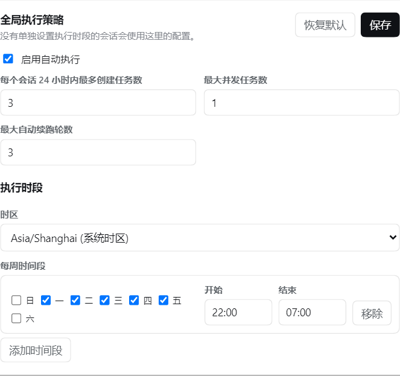
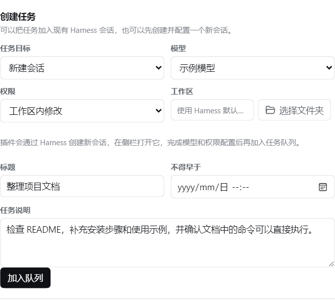

# LeisureTimeQueue

`leisure-time-queue` 是一个基于 DeepSeek Harness 的本地闲时任务队列插件。

你可以预先写好任务，并指定每周允许开始执行的时间段，例如“工作日 22:00 到次日 07:00”。只要 DeepSeek Harness 保持运行、目标会话可用且 Agent 处于空闲状态，插件就会按队列顺序自动开始任务。

任务仍在你自己的 DeepSeek Harness 中运行，并使用你已经配置的模型、凭据、权限和本地工作区。尽情享受梁文谷吧。

## 主要功能

- 在插件界面中配置每周执行时间段，可设置多个不同时段。
- 默认使用操作系统时区，可执行设置时区。
- 创建任务时可以选择已有会话，也可以创建新会话。
- 可以直接从当前会话标题栏把输入框内容加入闲时任务队列。
- 侧边栏提供全局任务入口，可创建任务并管理所有会话中的队列。
- 新建会话时可以选择模型、权限预设和工作区。
- 按 FIFO（先进先出）顺序执行队列。
- 支持暂停、恢复、取消、重试、编辑、删除和立即执行。
- 支持全局执行策略，以及针对单个会话设置不同的时间段。
- 支持 Harness 重启后的队列持久化和已派发任务恢复。


## 兼容版本

本文档对应以下版本：

| 组件 | 版本要求 | 说明 |
| --- | --- | --- |
| |
| DeepSeek Harness CLI | `@deepseek-ai/dsh@0.1.2-rc.1` | 至少需要此版本 |
| DeepSeek Harness 相关包 | `0.1.2-rc.1` | 至少需要此版本 |
 |


## 安装前准备

你需要准备：

1. 满足版本要求的 Node.js。
2. 插件安装包 `leisure-time-queue-<version>.tgz`。
3. DeepSeek Harness 中至少一个已经配置并可正常调用的模型。

先检查 Node.js 版本：

```sh
node --version
```

如果你拿到的是插件源码，而不是 `.tgz` 安装包，还需要 pnpm。可以使用 Corepack 启用推荐版本：

```sh
corepack enable
corepack prepare pnpm@11.7.0 --activate
pnpm --version
```

如果当前 Node.js 没有附带 Corepack，也可以执行：

```sh
npm install --global pnpm@11.7.0
```

只有源码时，请先进入插件目录生成安装包：

```sh
pnpm install
pnpm pack
```

成功后，目录中会出现 `leisure-time-queue-<version>.tgz`。如果你已经有这个文件，可以跳过打包步骤。

## Windows 安装

以下命令在 PowerShell 中执行。

### 1. 安装插件

进入存放 `.tgz` 文件的目录，并取得它的绝对路径：

```powershell
Set-Location "C:\path\to\plugin-package"
$pluginPackage = (Resolve-Path ".\leisure-time-queue-<version>.tgz").Path
```

将插件加入 DeepSeek Harness 的 Web profile：

```powershell
npx @deepseek-ai/dsh plugin --profile web add $pluginPackage
```

### 2. 启动 DeepSeek Harness

先进入你平时希望作为默认工作区的目录，再启动 Web 界面：

```powershell
Set-Location "C:\path\to\your-workspace"
npx @deepseek-ai/dsh web
```

启动命令所在目录会成为 DSH 的默认工作区。浏览器打开后即可配置插件。

Windows 的 Web profile 默认位于：

```text
%USERPROFILE%\.dsh\profiles\web
```

在本机浏览器中使用时，选择工作区通常会打开 Windows 原生文件夹选择窗口。

## macOS 安装

以下命令在 Terminal 中执行。

### 1. 安装插件

```bash
cd "/path/to/plugin-package"
plugin_package="$(pwd)/leisure-time-queue-<version>.tgz"
npx @deepseek-ai/dsh plugin --profile web add "$plugin_package"
```

### 2. 启动 DeepSeek Harness

```bash
cd "/path/to/your-workspace"
npx @deepseek-ai/dsh web
```

macOS 的 Web profile 默认位于 `~/.dsh/profiles/web`。在本机浏览器中使用时，选择工作区通常会打开 macOS 原生文件夹选择窗口。

## Linux 安装

以下命令在终端中执行。

### 1. 安装插件

```bash
cd "/path/to/plugin-package"
plugin_package="$(pwd)/leisure-time-queue-<version>.tgz"
npx @deepseek-ai/dsh plugin --profile web add "$plugin_package"
```

### 2. 启动 DeepSeek Harness

```bash
cd "/path/to/your-workspace"
npx @deepseek-ai/dsh web
```

Linux 的 Web profile 默认位于 `~/.dsh/profiles/web`。

如果桌面环境安装了 Zenity 或 KDialog，工作区选择可以使用系统文件夹选择窗口。在 SSH、远程环境或没有图形选择器时，DSH 会使用内置目录浏览界面。

## 第一次使用

### 1. 先确认模型可以正常调用

在创建闲时任务前，建议先打开一个普通 DSH 会话，选择准备使用的模型并发送一条测试消息。

这一步可以提前确认：

- 模型提供方已经配置 API Key 或其他凭据。
- 当前模型在 DSH 中确实可用。
- 模型权限和工作区配置符合预期。

如果普通会话也无法调用模型，应先在 DSH 的“设置 → 模型”中完成模型和凭据配置。

### 2. 从当前会话快速创建任务

打开任意会话后，点击会话标题栏中的“闲时执行”。插件会自动：

- 使用当前会话作为任务目标；
- 读取当前输入框中的文字作为任务说明；
- 复用当前会话的模型、凭据、权限和工作区；
- 在标题留空时，根据任务说明第一行自动生成标题。

确认任务说明后点击“加入队列”即可。任务加入成功后，输入框中的原内容不会被清空。

### 3. 从侧边栏管理任务

点击侧边栏底部、设置按钮上方的“闲时任务”：

- “任务队列”页可以查看所有会话中的等待、执行中、失败和已完成任务；
- 可以暂停、恢复、立即执行、取消、重试、编辑或删除任务；
- 点击任务上的会话名称可以返回对应会话；
- “新建任务”页可以选择现有会话，也可以创建新会话。

侧边栏收起时，该入口显示为时钟图标；存在活动任务时会显示数量角标。

### 4. 打开插件配置

进入：

```text
设置 → 插件 → 插件配置 → 闲时任务队列
```

展开“闲时任务队列”卡片：


如果没有看到插件，请先完全停止并重新启动 DSH。插件 Bundle 在运行过程中不会自动重新加载。

插件设置页主要用于配置执行时段、时区、并发限制和单个会话的覆盖策略。日常创建和管理任务通常不需要再进入设置页。

### 5. 配置全局执行策略

在“全局配置”中设置：

- **启用自动执行**：关闭后，队列任务不会按时间段自动开始。
- **每日创建上限**：限制一天内可以创建的任务数量。
- **最大并发任务数**：同一时间最多运行多少个任务。普通电脑建议先设为 `1`。
- **最大自动续跑轮数**：任务需要继续运行时，最多允许 Agent 自动续跑多少轮。
- **时区**：首次安装默认使用操作系统时区，可从常用时区下拉框中调整。
- **每周时间段**：指定哪些星期、从几点到几点允许任务开始。



安装后的时间段默认为空。即使“启用自动执行”已经打开，没有配置时间段时也不会自动执行任务。

跨午夜时间段按照开始日计算。例如：

```text
周一 22:00 → 07:00
```

表示周一 22:00 开始，一直持续到周二 07:00。

设置完成后点击保存。

### 6. 创建任务

在“创建任务”区域选择任务目标。

#### 使用现有会话

适合需要继续使用已有上下文的任务。任务会沿用该会话已有的：

- 模型和模型提供方。
- 对话上下文。
- 权限设置。
- 工作区和可用工具。

下拉框会优先显示会话标题；没有标题时才显示会话标识。

#### 新建会话

适合与当前对话无关的独立任务。你可以设置：

- 模型。
- 权限预设。
- 工作区。

工作区不需要手工输入路径。点击“选择文件夹”，使用 DSH 自带的文件夹选择方式；留空则使用启动 DSH 时所在的默认工作区。

模型推理强度遵循 DSH 对所选模型提供的当前或默认设置。某个模型在 DSH 中不支持选择推理强度时，插件也不会要求用户设置该项，更不会强制发送不兼容的推理强度。

然后填写：

- **标题**：便于在任务队列中识别。
- **任务说明**：告诉 Agent 要完成什么，以及完成标准是什么。
- **不得早于**：可选。用于规定任务最早可以开始的日期和时间。



最后点击创建。任务会进入队列，等待满足执行条件。

## 任务什么时候会执行

队列中的任务只有同时满足以下条件时才会开始：

1. DeepSeek Harness 进程仍在运行。
2. 插件的“启用自动执行”已打开。
3. 当前时间位于任务适用的每周执行时间段内。
4. 已经到达任务设置的“不得早于”时间。
5. 目标会话已打开并可用。
6. 目标会话的 Agent 当前处于空闲状态。
7. 当前运行数量没有超过“最大并发任务数”。
8. 按 FIFO 顺序已经轮到该任务。

时间段控制的是“任务何时允许开始”。任务一旦开始，即使随后离开时间段，也不会因为时间段结束而被插件自动中断。

“立即执行”只会绕过每周时间段限制。会话可用、Agent 空闲和并发限制仍然必须满足，因此点击后不一定会在同一瞬间启动。

如果关闭浏览器页面但 DSH 进程仍在运行，任务是否可继续取决于目标会话是否仍由 Harness 保持在线。直接关闭终端或停止 DSH 进程后，任务不会在后台服务器上继续运行。

## 会话时间段覆盖

默认情况下，所有会话使用全局时间段。

如果某个会话需要不同的执行安排，可以在“会话时段与任务队列”中选择该会话，启用会话级覆盖并配置单独的时区和时间段。关闭覆盖后，会话会重新使用全局策略。

例如：

- 全局任务只允许工作日夜间执行。
- 某个专门用于维护的会话允许周六白天执行。
- 某个重要会话暂时设置为空时间段，禁止自动启动任务。

## 管理任务

任务进入队列后，可以执行以下操作：

- **编辑**：修改标题、任务说明或“不得早于”时间。
- **暂停**：暂时阻止任务被调度。
- **恢复**：让暂停的任务重新进入等待状态。
- **取消**：取消等待中或运行中的任务。
- **重试**：将失败或已取消的任务重新加入队列。
- **立即执行**：忽略时间段并尝试尽快开始。
- **删除**：从队列中移除任务记录。

删除是不可恢复操作。如果只是暂时不希望执行，优先使用“暂停”。

## 也可以通过 Agent 操作

除了网页界面，也可以直接在会话中用自然语言让 Agent 管理队列，例如：

```text
把“整理项目文档”加入闲时任务队列，今晚 22:00 以后再执行。
```

```text
列出当前会话中的闲时任务。
```

```text
把当前会话的执行时间设置为周一到周五 22:00 至次日 07:00，
时区使用 Asia/Shanghai。
```

```text
暂停标题为“整理项目文档”的任务。
```

网页界面和 Agent 工具操作的是同一份本地队列数据。

## 更新插件

拿到新版本的 `.tgz` 文件后，重新执行对应操作系统的安装命令：

```sh
npx @deepseek-ai/dsh plugin --profile web add "/absolute/path/to/leisure-time-queue-x.y.z.tgz"
```

更新完成后，必须停止并重新启动 DSH。

## 卸载插件

```sh
npx @deepseek-ai/dsh plugin --profile web remove leisure-time-queue
```

卸载后重新启动 DSH。
